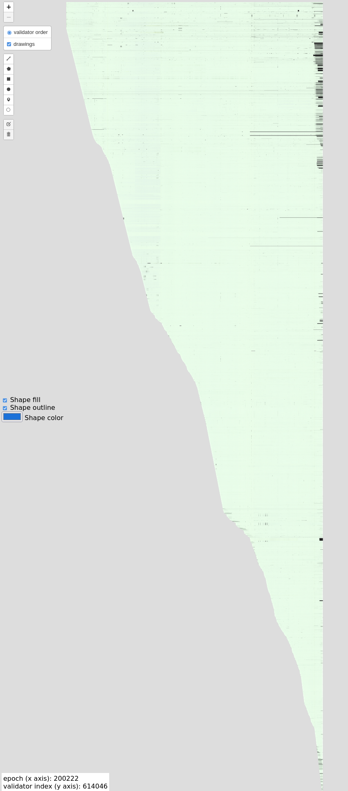

# consensus.actor

*work in progress, site is not currently deployed*

Site to view Ethereum consensus-layer activity:
a network-wide historical view of attester performance as interactive map.

Mainnet Ethereum Beacon-chain, at ~201K epochs, ~624K validators:

## Background

End sept 2021 (when I was still at the EF) I hacked together a similar but more limited tool;
no live updates, and hooked straight to a Lighthouse leveldb dump, it was very hacky (no CLI, just hacks).

July 2022 I updated it, with (mostly broken) live updates, and hit a DB-lookup bottleneck:
indexing the data was extremely slow, because of the random access to Lighthouse leveldb data,
and large amount of data copies.

Nov 2022 Attempt at reducing data-copies, optimizing the program. Indexing was still very slow.

May 2023 Big refactor, using the Nimbus Era file archive data for fast historical beaconchain data access.

## License

MIT License, see [LICENSE file](./LICENSE).

